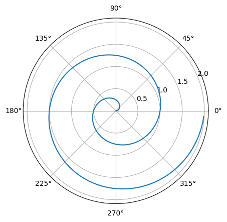

# SunQuarTeX Example - Jupyter Notebook
sun123zxy
2023-02-14

# Title

This is a sample Jupyter Notebook using SunQuarTeX.

Below is an example of a Python code cell:

``` python
import numpy as np
import matplotlib.pyplot as plt

r = np.arange(0, 2, 0.01)
theta = 2 * np.pi * r
fig, ax = plt.subplots(
  subplot_kw = {'projection': 'polar'} 
)
fig.patch.set_alpha(0)
ax.patch.set_alpha(0)

ax.plot(theta, r)
ax.set_rticks([0.5, 1, 1.5, 2])
ax.grid(True)
plt.show()
```

<div id="fig-polar">



Figure 1: A line plot on a polar axis

</div>

Quarto’s specific Markdown feature still works in Jupyter Notebook. For example:

<div id="thm-oh" class="theorem">

<span class="theorem-title">**Theorem 1 (This)**</span> is a theorem.

</div>
