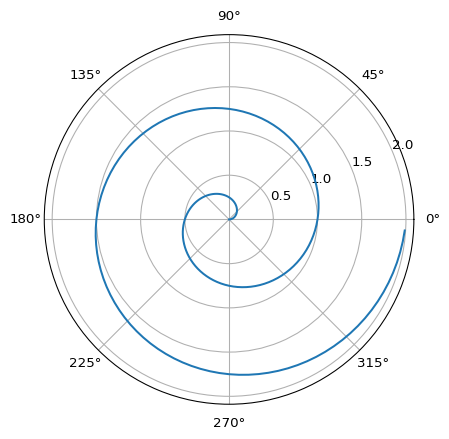
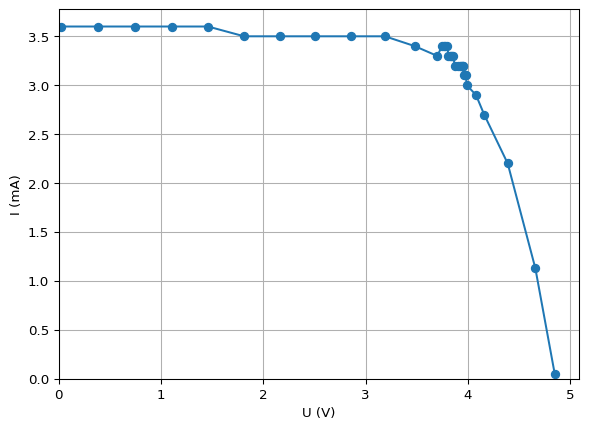
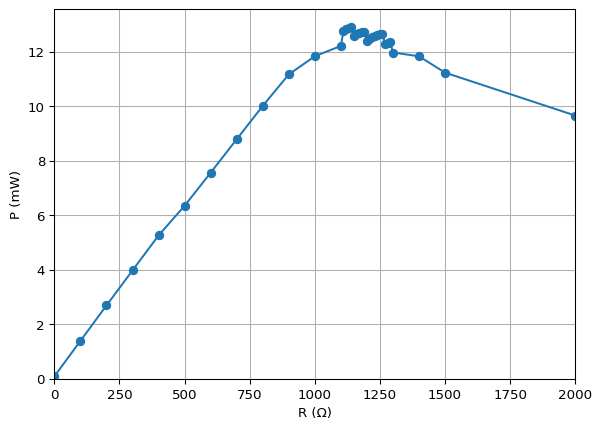

# README
sun123zxy

<h1 align="center">

SunQuarTeX
</h1>

<p align="center">

Write once, present everywhere!<br/>基于 Quarto 的多格式输出中英文学术写作模板库
</p>

<p align="center">

<a href="https://github.com/sun123zxy/sunquartex">Github 仓库</a> · <a href="https://sun123zxy.github.io/sunquartex">网页 Demo</a>
</p>

## 核心功能

Quarto 基础功能：

- 基于 Pandoc’s Markdown 的完备学术写作语法
- 强大的交叉引用与定理系统功能
- HTML、PDF/LaTeX、Beamer、Github Flavored Markdown (GFM) 全格式输出；MS Word、PPT 有限支持
- 嵌入 Python 代码生成数据图表（Computation）
- Mermaid、Graphviz 流程图绘制（Diagram）

额外支持：

- TikZ / [tikz-cd](https://ctan.org/pkg/tikz-cd) / [quiver](https://q.uiver.app/) 图表绘制
- Lean 代码高亮与源码导入转 Markdown
- RST-style list tables
- Github Actions 自动生成 Demo 站点

推荐在网页 Demo 中阅读本 README．

## 基础安装

- 下载并安装 [quarto-cli](https://quarto.org/)．本仓库渲染使用 Quarto 版本为 1.7.34．

  - （推荐）安装 [VSCode](https://code.visualstudio.com/) IDE 并安装 [Quarto](https://marketplace.visualstudio.com/items?itemName=quarto.quarto) 插件．

- 创建新文章时使用 Github Template 以本仓库为模板建立新仓库．您也可以下载本仓库的压缩包或 clone 到本地．

- 仓库根目录命令行执行 `quarto render helloworld.qmd --to=html` 测试安装情况．

PDF / Beamer 输出等可选项安装和使用方法参见后文 <a href="#sec-optional" class="quarto-xref">小节 5</a>．另外，纯命令行的自动化 CI 流程可参见本仓库下的 Github Actions 配置文件．

## 基础使用

### 渲染

在仓库根目录命令行执行 `quarto render path/to/your_file.qmd --to=your_format`．

- 使用 `--to` 参数指定输出类型，包括 `html`, `pdf`， `beamer`, `docx`, `gfm`．如果已经在文档头中 `format` 选项下列明输出格式，也可不在命令行中指定该选项．

示例文件请在 [`examples/`](examples/) 目录下查看．其中或包含可选支持内容，请安装相应依赖或删除对应内容后渲染．

### 写作

Quarto 使用的底层 Markdown 方言为 [Pandoc’s Markdown](https://pandoc.org/MANUAL.html#pandocs-markdown)．速成可直接参考示例文档或 [Quarto](https://quarto.org/docs/authoring/markdown-basics.html) 官方教程．

文档中开头部分 `---` 之间的内容称为 YAML 文档头（YAML Front Matter），用于设置文档相关元信息，也用于设置输出格式、样式等．您在自定义的过程中可能需要修改或添加它们．

针对特定输出格式的设置请在文档头 `format` 下对应格式选项下设置．希望全局生效的设置（一般）可在文档头顶层设置．

（重要）在文件头声明 `lang=zh` 或 `lang=en` 调整语言．该选项会影响文档的格式和渲染方式。

## 更新

如果您文章的仓库由 Github Template 创建，或者已经在使用 Git 版本控制，我们推荐使用如下方式拉取源仓库的更新：

``` sh
git remote add sunquartex git@github.com:sun123zxy/sunquartex.git # 添加 sunquartex 作为第二远程仓库
git pull sunquartex master --allow-unrelated-histories --no-commit # 拉取并尝试合并 sunquartex 的更新
# 手动处理合并冲突
git add .
git commit -m "merge updates from sunquartex" # commit 合并
git push # push 到你的远程仓库
```

- `--allow-unrelated-histories` 选项只有在第一次合并时需要添加．
- `--no-commit` 选项用于防止自动 commit 合并．本仓库更新很不稳定，建议每次合并都手动处理．

## 可选项安装与使用

### LaTeX / PDF / Beamer 输出

我们没有直接使用 Quarto 默认的 PDF 输出，而是完全重新设计了输出模板（`_assets/suntemp-art.tex`, `_assets/suntemp-pre.tex`）．大动干戈的目的有个人喜好方面的考量：Quarto 默认使用 Koma-Script 系列的 `scrartcl` 文档类，而我们希望在英文环境下保留 `article` 文档类的原汁原味，也希望在中文环境下使用 `ctexart` / `ctexbeamer` 文档类获得更好的排版格式．

重新设计 PDF 模板，您可以参考 [Quarto 的模板自定义教程](https://quarto.org/docs/journals/templates.html)．

#### 安装

安装 Quarto 支持的 LaTeX 发行版．若无，可使用 `quarto install tinytex --update-path` 安装．

#### 使用

正常指定 format 即可．

- 可在渲染时使用 `--to=latex` 选项输出中间 `.tex` 文件．

### Computation 功能

直接嵌入 Python 代码就可以动态生成数据图表．[Quarto 文档](https://quarto.org/docs/computations/python.html)

#### 安装

- 安装适当版本 Python
- 命令行 `pip install .` 安装 `pyproject.toml` 列明的所需模块

#### 使用

使用例：

``` python
import numpy as np
import matplotlib.pyplot as plt

r = np.arange(0, 2, 0.01)
theta = 2 * np.pi * r
fig, ax = plt.subplots(
  subplot_kw = {'projection': 'polar'} 
)
fig.patch.set_alpha(0)
ax.patch.set_alpha(0)

ax.plot(theta, r)
ax.set_rticks([0.5, 1, 1.5, 2])
ax.grid(True)
plt.show()
```

<div id="fig-polar">



图 1: A line plot on a polar axis

</div>

### 表格

#### 传统 Markdown 表格

|                  |             |             |             |
|:----------------:|:-----------:|:-----------:|:-----------:|
| $L_i \times C_j$ |     $2$     | $\mathbb N$ | $\mathbb R$ |
|       $2$        |     $4$     | $\mathbb N$ | $\mathbb R$ |
|   $\mathbb N$    | $\mathbb N$ | $\mathbb N$ |      ?      |
|   $\mathbb R$    | $\mathbb R$ |      ?      | $\mathbb R$ |

#### Markdown grid style tables

|     |     |      |     |     |
|-----|-----|------|-----|-----|
| a   | be  | c    | d   | e   |
| f   |     | ew   | a   | b   |
| c   | d   | ewfe |     | e   |
| f   | g   | h    | r   | e   |

#### RST-style list tables

我们还支持 [RST-style list tables](https://github.com/pandoc-ext/list-table)．该格式可以比较方便地合并单元格．

| row 1, column 1 |  row 1, column 2   | row 1, column 3 |
|:---------------:|:------------------:|:---------------:|
| row 2, column 1 |  row 2, column 2–3 |                 |
| row 3, column 1 |  row 3, column 2   | row 3, column 3 |

亦见 [`examples/timetable.qmd`](examples/timetable.qmd)．

#### Computation based tables

您也可以直接使用代码生成表格：

``` python
import numpy as np
import math
from IPython.display import Markdown, display
from tabulate import tabulate
import matplotlib.pyplot as plt

R = np.array([0,100,200,300,400,500,600,700,800,900,1000,
1100,1110,1120,1130,1140,1150,1160,1170,1180,1190,
1200,1210,1220,1230,1240,1250,1260,1270,1280,1290,
1300,1400,1500,2000,4000,math.inf])
U = np.array([24.2E-3, 0.386,0.747,1.104,1.460,1.813,2.16,2.51,2.86,3.19,3.48,
3.70,3.75,3.77,3.78,3.80,3.81,3.83,3.84,3.85,3.86,
3.87,3.90,3.92,3.93,3.94,3.95,3.95,3.96,3.97,3.98,
3.99,4.08,4.16,4.39,4.66,4.85])
I = np.array([3.6,3.6,3.6,3.6,3.6,3.5,3.5,3.5,3.5,3.5,3.4,
3.3,3.4,3.4,3.4,3.4,3.3,3.3,3.3,3.3,3.3,
3.2,3.2,3.2,3.2,3.2,3.2,3.2,3.1,3.1,3.1,
3.0,2.9,2.7,2.2,1.130,47.7E-3])
P = U*I
```

<div id="tbl-light-on">

``` python
table = [[R[i], U[i], I[i], P[i]] for i in list(range(0, 11)) + [11,21,31,32,33,34,35,36]]
display(Markdown(tabulate(table, headers=["R (Ω)", "U (V)", "I (mA)", "P (mW)"])))
table = [[R[i], U[i], I[i], P[i]] for i in range(12, 31)]
display(Markdown(tabulate(table, headers=["R (Ω)", "U (V)", "I (mA)", "P (mW)"])))
```

<div class="cell-output cell-output-display cell-output-markdown">

<div id="tbl-light-on-1">

| R (Ω) |  U (V) | I (mA) |   P (mW) |
|------:|-------:|-------:|---------:|
|     0 | 0.0242 |    3.6 |  0.08712 |
|   100 |  0.386 |    3.6 |   1.3896 |
|   200 |  0.747 |    3.6 |   2.6892 |
|   300 |  1.104 |    3.6 |   3.9744 |
|   400 |   1.46 |    3.6 |    5.256 |
|   500 |  1.813 |    3.5 |   6.3455 |
|   600 |   2.16 |    3.5 |     7.56 |
|   700 |   2.51 |    3.5 |    8.785 |
|   800 |   2.86 |    3.5 |    10.01 |
|   900 |   3.19 |    3.5 |   11.165 |
|  1000 |   3.48 |    3.4 |   11.832 |
|  1100 |    3.7 |    3.3 |    12.21 |
|  1200 |   3.87 |    3.2 |   12.384 |
|  1300 |   3.99 |      3 |    11.97 |
|  1400 |   4.08 |    2.9 |   11.832 |
|  1500 |   4.16 |    2.7 |   11.232 |
|  2000 |   4.39 |    2.2 |    9.658 |
|  4000 |   4.66 |   1.13 |   5.2658 |
|   inf |   4.85 | 0.0477 | 0.231345 |

(a) （粗）

</div>

</div>

<div class="cell-output cell-output-display cell-output-markdown">

<div id="tbl-light-on-2">

| R (Ω) | U (V) | I (mA) | P (mW) |
|------:|------:|-------:|-------:|
|  1110 |  3.75 |    3.4 |  12.75 |
|  1120 |  3.77 |    3.4 | 12.818 |
|  1130 |  3.78 |    3.4 | 12.852 |
|  1140 |   3.8 |    3.4 |  12.92 |
|  1150 |  3.81 |    3.3 | 12.573 |
|  1160 |  3.83 |    3.3 | 12.639 |
|  1170 |  3.84 |    3.3 | 12.672 |
|  1180 |  3.85 |    3.3 | 12.705 |
|  1190 |  3.86 |    3.3 | 12.738 |
|  1200 |  3.87 |    3.2 | 12.384 |
|  1210 |   3.9 |    3.2 |  12.48 |
|  1220 |  3.92 |    3.2 | 12.544 |
|  1230 |  3.93 |    3.2 | 12.576 |
|  1240 |  3.94 |    3.2 | 12.608 |
|  1250 |  3.95 |    3.2 |  12.64 |
|  1260 |  3.95 |    3.2 |  12.64 |
|  1270 |  3.96 |    3.1 | 12.276 |
|  1280 |  3.97 |    3.1 | 12.307 |
|  1290 |  3.98 |    3.1 | 12.338 |

(b) （细）

</div>

</div>

表 1: 太阳能电池的负载特性

</div>

<div id="fig-light-on">

``` python
fig, ax = plt.subplots()
fig.patch.set_alpha(0)
ax.patch.set_alpha(0)

ax.set_xlabel("U (V)")
ax.set_ylabel("I (mA)")

ax.plot(U, I, marker="o")
ax.grid(True)
ax.set_xlim(0)
ax.set_ylim(0)

plt.show()


fig, ax = plt.subplots()
fig.patch.set_alpha(0)
ax.patch.set_alpha(0)

ax.set_xlabel("R (Ω)")
ax.set_ylabel("P (mW)")

ax.plot(R, P, marker="o")
ax.grid(True)
ax.set_xlim((0, 2000))
ax.set_ylim(0)

plt.show()
```

<div class="cell-output cell-output-display">

<div id="fig-light-on-1">



(a) 输出电流与电压关系曲线

</div>

</div>

<div class="cell-output cell-output-display">

<div id="fig-light-on-2">



(b) 输出功率与负载电阻关系曲线

</div>

</div>

图 2: 太阳能电池的负载特性

</div>

#### 交叉引用

在表格外侧包裹 `::: {#tbl-label}` 块．表格 caption 置于块的最后一行．例如：

<div id="tbl-table-example">

|     |     |      |     |     |
|-----|-----|------|-----|-----|
| a   | be  | c    | d   | e   |
| f   |     | ew   | a   | b   |
| c   | d   | ewfe |     | e   |
| f   | g   | h    | r   | e   |

表 2: A Table

</div>

### Diagram 流程图（Mermaid、Graphviz 等）

[Quarto 文档](https://quarto.org/docs/authoring/diagrams.html)

#### 安装

非 HTML 格式下需要额外安装 Chrome 或 Chromium．

- 若无，可使用 `quarto install tool chromium` 安装，见 [Quarto - Diagrams \# Chrome Install](https://quarto.org/docs/authoring/diagrams.html#chrome-install)

### TikZ / TikZ-cd / Quiver 交换图

该功能由 [`_assets/tikz.lua`](_assets/tikz.lua) 实现．

#### 安装

如果只是输出到 PDF / Beamer，除了安装 LaTeX 发行版之外没有别的额外步骤．

如还需输出至其它格式：请确保 XeLaTeX、dvisvgm、mutool 已在 PATH 中，且提前安装需要使用的 LaTeX 宏包：

- 安装用于 TikZ 渲染的 LaTeX 宏包：

  新建任意空白 Quarto 文档 `temp.qmd` 并执行

  `quarto render temp.qmd --to=pdf --template=_assets/suntemp-tikz.tex`

  随后删除 `temp.qmd`．

  如果后续渲染时仍然提示缺少宏包，请手动安装，例如手动安装 `standalone` 宏包：执行 `tlmgr install standalone`

- 使用 Quarto 自带的 TinyTeX 安装 `dvisvgm`：

  - 执行 `tlmgr install dvisvgm` 和 `tlmgr path add` 下载 dvisvgm 并添加至 PATH．

- 安装 `mutool`：

  - （Linux / WSL）执行 `sudo apt install mupdf-tools`．
  - （Windows）请自行在 [MuPDF](https://mupdf.com/) 官网下载并安装 MuPDF，并确保 `mutool` 在 PATH 中．

<div class="proof remark">

<span class="proof-title">*注记*. </span>关于 mutool 必要性的说明：

> As of Ghostscript 10.01.0, this will no longer work due to the introduction of a new PDF interpreter. Therefore, an alternative conversion module based on mutool, a utility which is part of the MuPDF package, has been introduced. It’s automatically invoked if Ghostscript can’t be used and if a working mutool executable is present in a directory which is part of the system’s search path.
>
> 来自 [dvisvgm manual](https://dvisvgm.de/Manpage/)

</div>

#### 使用

推荐使用 [quiver](https://q.uiver.app/) 在线编辑器生成交换图代码．使用例：

<div id="fig-tikzcd">

``` {tikz}
\begin{tikzcd}
    B && A & \rightsquigarrow & B && A
    \arrow[""{name=0, anchor=center, inner sep=0}, "g"{description}, from=1-3, to=1-1]
    \arrow[""{name=1, anchor=center, inner sep=0}, "f", curve={height=-30pt}, from=1-3, to=1-1]
    \arrow[""{name=2, anchor=center, inner sep=0}, "h"', curve={height=30pt}, from=1-3, to=1-1]
    \arrow[""{name=3, anchor=center, inner sep=0}, "h"', curve={height=30pt}, from=1-7, to=1-5]
    \arrow[""{name=4, anchor=center, inner sep=0}, "f", curve={height=-30pt}, from=1-7, to=1-5]
    \arrow["\alpha"', shorten <=4pt, shorten >=4pt, Rightarrow, from=1, to=0]
    \arrow["\beta"', shorten <=4pt, shorten >=4pt, Rightarrow, from=0, to=2]
    \arrow["{\beta \circ_1 \alpha}"', shorten <=8pt, shorten >=8pt, Rightarrow, from=4, to=3]
\end{tikzcd}
```

图 3: TikZ-cd / Quiver 示例

</div>

<div id="fig-tikz">

``` {tikz}
\begin{tikzpicture}

  % left: parameter line (the t-axis)
  \begin{scope}[shift={(-4,0)}]
    \draw[->] (-1.5,0) -- (1.5,0) node[below right] {$t$};
    \coordinate (T) at (-1.00, 0);
    \fill (T) circle (1.2pt) node[below=3pt] {$t$};
    \fill (0,0) circle (1.2pt) node[below=3pt] {$0$};
  \end{scope}

  % arrow indicating the map
  \draw[->] (-1.8,0) -- (-0.8,0) node[midway,above] {$\operatorname{Spec} \varphi$};

  % right: (x,y)-plane
  \draw[->] (-0.1,0) -- (2.0,0) node[below] {$x$};
  \draw[->] (0,-1.2) -- (0,1.2) node[left] {$y$};

  % cusp curve y^2 = x^3 via param t -> (t^2, t^3)
  \draw[thick,domain=-1.2:1.2,smooth,variable=\t]
    plot ({\t*\t},{\t*\t*\t});
  \node[right] at (1.4,1.65) {$y^2=x^3$};

  % image of a sample parameter t
  \coordinate (P) at ({1.00*1.00},{-1.00*1.00*1.00});
  \fill (P) circle (1.4pt) node[above right] {$(t^2,t^3)$};

\end{tikzpicture}
```

图 4: TikZ 示例

</div>

<div class="proof remark">

<span class="proof-title">*注记*. </span>在 Beamer 中使用 TikZ 时，所在幻灯片须添加 `{.fragile}` 标记．

</div>

### (Preview) Lean 代码高亮与带注释源码导入

[`assets/lean.xml`](assets/lean.xml) 用于 Pandoc 的 Lean 代码高亮．直接使用 `lean` 作为代码块的语言标记即可．

[`_assets/lean-include.lua`](_assets/lean-include.lua) shortcode 用于直接将带有注释的 Lean 代码导入转换为 Markdown．使用如下格式即可导入：

``` qmd

```

<div class="proof remark">

<span class="proof-title">*注记*. </span>该功能仍在 Preview 阶段，目前 HTML 的目录导航和 PDF 格式的 unicode 支持存在问题．

</div>

### Github Actions + Github Pages 网站生成

本仓库同时采用 Github Actions + Github Pages 自动生成 Demo 站点．

#### 安装

首次使用时，在 Actions 分页中激活 Actions，在本地手动进行第一次网站发布：

- 修改 `_quarto-website.yml` 下 `site-url` 为你的域名（如您使用非 Github Pages 的默认网站域名，请在根目录下额外添加 CNAME 文件）
  - 嫌麻烦的话也可以直接删除这个选项．
- 命令行内设置环境变量 `QUARTO_PROFILE` 为 `website`
- 执行 `quarto publish`
- （清除环境变量）

#### 使用

以后的每次 push 均会触发 Github Actions 自动完成的网站生成．

## 样式自定义

修改 YAML 文档头可以自定义部分默认样式．

### 我要改字号！

目前仅支持 PDF 字号修改．英文文档默认字号为 10pt，中文文档默认字号为 10.5pt（五号，详见 CTeX 手册）．

``` yaml
format:
  pdf:
    fontsize: 12pt
```

### 我要 / 不想要目录！

``` yaml
toc: true # 开启目录
```

该设置全局 / 特定格式下均生效．

### 我不想给 section 编号 / 我要改 section 编号格式！

``` yaml
number-sections: true # section 编号开关
number-depth: 3 # section 编号深度
```

该设置全局 / 特定格式下均生效．

### 我不想给定理编号！/ 我要改定理编号格式！

Quarto 内置的定理编号系统目前无法修改（见 [Quarto Discussion \#5479](https://github.com/quarto-dev/quarto-cli/discussions/5479)），但我们提供自定义 PDF 格式定理编号的可能．（目前仍然无法实现完全关闭 PDF 格式中的定理编号）

``` yaml
format:
  pdf:
    custom-theorem:
      numbered-within: section # 开启后将相对于 section（或 subsection, etc.）进行定理编号
      numbered-alike: true # 开启后不同类型的定理将共享编号
```

注意使用 ´numbered-within´ 前请先开启 ´number-sections´．

### 我要改引用格式！

PDF / Beamer 输出使用 BibLaTeX alphabetical，HTML 输出使用 IEEE．如需修改，请自定义 `sun*****.cls` 和 `_format.yml` 和 CSL 文件．

### 我要更丰富的 Callout 定理包裹样式！

请移步 [sun123zxy/quarto-callouty-theorem](https://github.com/sun123zxy/quarto-callouty-theorem) 学习配置方法．

### 我要改 Beamer 幻灯片的颜色！

``` yaml
format:
  beamer:
    custom-color:
      define: \definecolor{blueblk}{HTML}{1874D0} # 在这里用 LaTeX 自定义颜色供后面使用
      main: green!40!black # 主色调
      theorem: green!32!black # 各种定理环境颜色
      example: blueblk!50!black # Example / Exercise 环境颜色
      remark: white!15!black # Proof / Solution / Remark 环境颜色
      link: lime!85!black # 链接颜色
```

### PDF / Beamer 宏包不够用，我要自己导入！

``` yaml
format:
  html:
    include-in-header: 
      text: |
        \(\require{physics}\)
  pdf:
    include-in-header:
      text: |
        \usepackage{physics}
```

亦见 [`examples/extra.qmd`](examples/extra.qmd)．暂时不支持其它格式下的宏包导入．

## Q&A

### 一般性的

#### 示例文件编译不了！

示例文件包含了部分可选支持内容，如未安装相应依赖，请删除对应内容后渲染．

#### 我不懂 Computer Science，你能不能讲人话！

请您活用 AI 工具降低学习门槛！您可以：

- 在网页 Demo 和 AI 聊天提问！
- 使用 VSCode 打开本仓库，使用自带的 Github Copilot，将 README 扔进对话框，提出您的具体需求并获得人话解答．

#### 我想要 XXX 功能！/ 我要自己魔改！

仓库主要为自用，如能为您的生活带来便利欢迎取用．想要的功能欢迎提 Issue 或 Discussion！（虽然不保证会做 :p

我们提供的 YAML 文档头样式只覆盖了了极小一部分功能．更深入的魔改需要您

- 进一步学习底层软件 Quarto，魔改本仓库的默认配置
- 进一步学习 Pandoc，编写 LaTeX 模板 / Lua filter

有能力欢迎 Fork 和 Pull Request．

#### 仓库太重，我想要 standalone 的单文件渲染！

请移步 [quarto-render](https://github.com/sun123zxy/quarto-render)，一个独立开发的小型命令行程序使得单文件 Quarto 渲染更加方便．

### 写作相关

#### 标题应该用多少个 `#`？

一般文档建议从二级标题开始编号（[相关讨论](https://community.rstudio.com/t/why-do-default-r-markdown-quarto-templates-use-second-level-headings-instead-of-first-level-ones/162127)）；Beamer 的 `slide-level` 可自适应标题级数，但其分节固定从一级标题开始，见 Pandoc 文档．

#### 分页符

``．见[官方文档](https://quarto.org/docs/authoring/markdown-basics.html#page-breaks)．

#### YAML 文档头里的字符串到底打不打引号？

可打可不打．打了的话需要注意特殊字符的转义问题（如 `\`）．

#### 用 `$` 包裹行内公式的正确格式

示例：`我们有 $(a + b)^2 = a^2 + 2ab + b^2$．证毕．`

`$` 内侧应紧接着公式中的非空格字符，外侧与中英文字符之间应有空格，与标点符号、连字符之间不留空格．参考 [Pandoc 文档](https://pandoc.org/MANUAL.html#extension-tex_math_dollars)．

### 输出相关

#### 写好的 Beamer 也想输出一份文稿版本的 PDF？

理论上与文档格式兼容，可直接设置 `--to=pdf` 输出文稿版本．

#### 我要输出到知乎！

您可以使用 GFM 格式输出，输出内容可复制至 [markdown.com.cn](https://markdown.com.cn/editor/) 的在线编辑器转知乎格式．

#### PDF 输出，LaTeX 渲染了十遍

您文档的交叉引用可能存在问题．请检查文档头的 `bibliography` 选项和正文中的引用情况．
