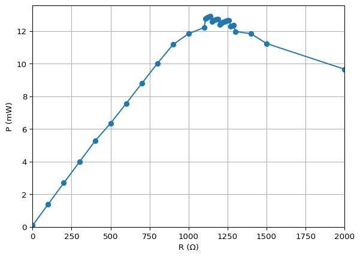

# $\SunQuarTeX$-cnart 测试文档
sun123zxy, 佚名
2022-12-07

## 前言

$\SunQuarTeX$ 的具体使用方法参见 [sun123zxy/sunquartex](https://github.com/sun123zxy/sunquartex)．

## 文章结构测试 $\SunQuarTeX$

这一节测试文章结构．

### 文章分 $\SunQuarTeX$ 节

非常非常非常非常非常非*常非常非常非*常非常非常非常非常**非常非常非常**非常非常非常非常非常非常非常非常长的句子．

#### 文章分分 $\SunQuarTeX$ 节

Quarto 支持交叉引用．比如这一节的标题就已经被打上了标签．

##### 分分分 $\SunQuarTeX$ 节

本节中我们测试交叉引用 <a href="#sec-test" class="quarto-xref">小节 2.1.1</a>．

###### 分分分分 $\SunQuarTeX$ 节

这是最小的一级了．

$$
\SunQuarTeX
$$

## 图片、表格、列表测试

<div id="fig-figure">


图 1: 这是一张插图

</div>

交叉引用 <a href="#fig-figure" class="quarto-xref">图 1</a> 当然也是可以的．

这是一个紧凑列表．

- 自反性．
- 反对称性一个和非常非常非常非常非常非常非常非常非常非常非常非常非常非常非常非常非常非常非常非常非常非常非常非常长的句子．
- 传递性．

这是一个宽松列表．

- 自反性．

- 反对称性一个和非常非常非常非常非常非常非常非常非常非常非常非常非常非常非常非常非常非常非常非常非常非常非常非常长的句子．

  还多加了一段．

- 传递性．

这是一个定义列表．

自反性  
$a \sim a$

反对称性  
$a \leq b \land b \leq a \implies a=b$

传递性  
$a \leq b \land b \leq c \implies a \leq c$

当然也可以使用 Markdown 表格．例如 <a href="#tbl-cartesian-unsolved" class="quarto-xref">表 1 (a)</a>.

多表格并列．加上 <a href="#tbl-power-unsolved" class="quarto-xref">表 1 (b)</a>，它们共同组成了 <a href="#tbl-panel-unsolved" class="quarto-xref">表 1</a>．

<div id="tbl-panel-unsolved">

<div id="tbl-cartesian-unsolved">

|                  |             |             |             |
|:----------------:|:-----------:|:-----------:|:-----------:|
| $L_i \times C_j$ |     $2$     | $\mathbb N$ | $\mathbb R$ |
|       $2$        |     $4$     | $\mathbb N$ | $\mathbb R$ |
|   $\mathbb N$    | $\mathbb N$ | $\mathbb N$ |      ?      |
|   $\mathbb R$    | $\mathbb R$ |      ?      | $\mathbb R$ |

(a) 笛卡尔积

</div>

<div id="tbl-power-unsolved">

|             |             |             |                 |
|:-----------:|:-----------:|:-----------:|:---------------:|
| $L_i^{C_j}$ |     $2$     | $\mathbb N$ |   $\mathbb R$   |
|     $2$     |     $4$     | $\mathbb R$ | $2^{\mathbb R}$ |
| $\mathbb N$ | $\mathbb N$ |      ?      |        ?        |
| $\mathbb R$ | $\mathbb R$ |      ?      |        ?        |

(b) 集合幂

</div>

表 1: 相关集合的势（不完整版）

</div>

我们支持 Markdown grid style 的表格．

|     |     |      |     |     |
|-----|-----|------|-----|-----|
| a   | be  | c    | d   | e   |
| f   |     | ew   | a   | b   |
| c   | d   | ewfe |     | e   |
| f   | g   | h    | r   | e   |

我们还支持 [RST-style list tables](https://github.com/pandoc-ext/list-table)．该格式可以比较方便地合并单元格．

| row 1, column 1 |  row 1, column 2   | row 1, column 3 |
|:---------------:|:------------------:|:---------------:|
| row 2, column 1 |  row 2, column 2–3 |                 |
| row 3, column 1 |  row 3, column 2   | row 3, column 3 |

## 数学公式、定理系统测试

这一节我们测试数学相关内容．直接在源文件中写 raw LaTeX 就可声明公式所需的宏定义．由于 `\DeclareMathOperator` 只能在 LaTeX 的导言区使用，这里我们用 `\newcommand` + `\operatorname` 的方式替代．

下面的公式使用了上面定义的 macro．
$$
\operatorname{ran}A := \{ y \mid (x,y) \in A \}
$$

两个集合 $A, B$ 的笛卡尔积定义为
$$
A \times B = \{\langle x,y \rangle \mid x \in A \land y \in B \}
$$

显然，笛卡尔积不满足交换律和结合律. 在势的视角下，它的表现如何呢？

<div id="thm-cartesian-preserve" class="theorem">

<span class="theorem-title">**定理 1 (笛卡尔积的保势性)**</span> 这是一个有 caption 的定理.

$$
A \preccurlyeq C \land B \preccurlyeq D \implies A \times B \preccurlyeq C \times D
$$

</div>

<div class="proof">

<span class="proof-title">*证明*. </span>建立单射
$$
\begin{aligned}
\varphi: A \times B &\to C \times D \\
\langle x,y \rangle &\mapsto \langle f(x), g(y) \rangle
\end{aligned}
$$
即可，其中 $f$ 和 $g$ 是由 $A \preccurlyeq C$ 和 $B \preccurlyeq D$ 确定的单射.

</div>

<div class="proof">

<span class="proof-title">*证明* (有标题的证明). </span>这是一个有 caption 的证明．

</div>

<div class="proof">

<span class="proof-title">*证明* (<a href="#thm-cartesian-preserve" class="quarto-xref">定理 1</a> 的证明). </span>这是一个带复杂 caption 的证明．

</div>

<div id="cor-random" class="theorem corollary">

<span class="theorem-title">**推论 1**</span> 等势意义下可用等势的集合替换参与笛卡尔积运算的集合，即
$$
A \approx C \land B \approx D \implies A \times B \approx C \times D
$$

这是一个没有 caption 的定理.

</div>

<div id="exm-rtimesn" class="theorem example">

<span class="theorem-title">**例 1**</span> 证明
$$
\mathbb R \times \mathbb N \approx \mathbb N \times \mathbb R \approx \mathbb R
$$

</div>

<div class="proof">

<span class="proof-title">*证明*. </span>利用 <a href="#thm-cartesian-preserve" class="quarto-xref">定理 1</a> 对 $\mathbb R \times 2$ 和 $\mathbb R \times \mathbb R$ 夹逼，立刻得到
$$
\mathbb R \approx \mathbb R \times 2 \preccurlyeq \mathbb R \times \mathbb N \preccurlyeq \mathbb R \times \mathbb R \approx \mathbb R
\implies \mathbb R \times \mathbb N \approx \mathbb N \times \mathbb R \approx \mathbb R
$$

</div>

<div class="proof solution">

<span class="proof-title">*解*. </span>这是一个解．

</div>

<div class="proof remark">

<span class="proof-title">*注记*. </span>这是一个注记．

</div>

## 数据可视化（Table, Figure & Diagram）

Quarto 的另一大卖点．

``` python
import numpy as np
import matplotlib.pyplot as plt

r = np.arange(0, 2, 0.01)
theta = 2 * np.pi * r
fig, ax = plt.subplots(
  subplot_kw = {'projection': 'polar'} 
)
fig.patch.set_alpha(0)
ax.patch.set_alpha(0)

ax.plot(theta, r)
ax.set_rticks([0.5, 1, 1.5, 2])
ax.grid(True)
plt.show()
```

<div id="fig-polar">


图 2: A line plot on a polar axis

</div>

交叉引用 <a href="#fig-polar" class="quarto-xref">图 2</a> 当然也是可以的.

这里再测试一些较复杂的并列效果．（<a href="#tbl-light-on" class="quarto-xref">表 2</a>, <a href="#tbl-light-on-1" class="quarto-xref">表 2 (a)</a>, <a href="#tbl-light-on-2" class="quarto-xref">表 2 (b)</a>, <a href="#fig-light-on" class="quarto-xref">图 3</a>, <a href="#fig-light-on-1" class="quarto-xref">图 3 (a)</a>, <a href="#fig-light-on-2" class="quarto-xref">图 3 (b)</a>）

``` python
import numpy as np
import math
from IPython.display import Markdown, display
from tabulate import tabulate
import matplotlib.pyplot as plt

R = np.array([0,100,200,300,400,500,600,700,800,900,1000,
1100,1110,1120,1130,1140,1150,1160,1170,1180,1190,
1200,1210,1220,1230,1240,1250,1260,1270,1280,1290,
1300,1400,1500,2000,4000,math.inf])
U = np.array([24.2E-3, 0.386,0.747,1.104,1.460,1.813,2.16,2.51,2.86,3.19,3.48,
3.70,3.75,3.77,3.78,3.80,3.81,3.83,3.84,3.85,3.86,
3.87,3.90,3.92,3.93,3.94,3.95,3.95,3.96,3.97,3.98,
3.99,4.08,4.16,4.39,4.66,4.85])
I = np.array([3.6,3.6,3.6,3.6,3.6,3.5,3.5,3.5,3.5,3.5,3.4,
3.3,3.4,3.4,3.4,3.4,3.3,3.3,3.3,3.3,3.3,
3.2,3.2,3.2,3.2,3.2,3.2,3.2,3.1,3.1,3.1,
3.0,2.9,2.7,2.2,1.130,47.7E-3])
P = U*I
```

<div id="tbl-light-on">

``` python
table = [[R[i], U[i], I[i], P[i]] for i in list(range(0, 11)) + [11,21,31,32,33,34,35,36]]
display(Markdown(tabulate(table, headers=["R (Ω)", "U (V)", "I (mA)", "P (mW)"])))
table = [[R[i], U[i], I[i], P[i]] for i in range(12, 31)]
display(Markdown(tabulate(table, headers=["R (Ω)", "U (V)", "I (mA)", "P (mW)"])))
```

<div class="cell-output cell-output-display cell-output-markdown">

<div id="tbl-light-on-1">

| R (Ω) |  U (V) | I (mA) |   P (mW) |
|------:|-------:|-------:|---------:|
|     0 | 0.0242 |    3.6 |  0.08712 |
|   100 |  0.386 |    3.6 |   1.3896 |
|   200 |  0.747 |    3.6 |   2.6892 |
|   300 |  1.104 |    3.6 |   3.9744 |
|   400 |   1.46 |    3.6 |    5.256 |
|   500 |  1.813 |    3.5 |   6.3455 |
|   600 |   2.16 |    3.5 |     7.56 |
|   700 |   2.51 |    3.5 |    8.785 |
|   800 |   2.86 |    3.5 |    10.01 |
|   900 |   3.19 |    3.5 |   11.165 |
|  1000 |   3.48 |    3.4 |   11.832 |
|  1100 |    3.7 |    3.3 |    12.21 |
|  1200 |   3.87 |    3.2 |   12.384 |
|  1300 |   3.99 |      3 |    11.97 |
|  1400 |   4.08 |    2.9 |   11.832 |
|  1500 |   4.16 |    2.7 |   11.232 |
|  2000 |   4.39 |    2.2 |    9.658 |
|  4000 |   4.66 |   1.13 |   5.2658 |
|   inf |   4.85 | 0.0477 | 0.231345 |

(a) （粗）

</div>

</div>

<div class="cell-output cell-output-display cell-output-markdown">

<div id="tbl-light-on-2">

| R (Ω) | U (V) | I (mA) | P (mW) |
|------:|------:|-------:|-------:|
|  1110 |  3.75 |    3.4 |  12.75 |
|  1120 |  3.77 |    3.4 | 12.818 |
|  1130 |  3.78 |    3.4 | 12.852 |
|  1140 |   3.8 |    3.4 |  12.92 |
|  1150 |  3.81 |    3.3 | 12.573 |
|  1160 |  3.83 |    3.3 | 12.639 |
|  1170 |  3.84 |    3.3 | 12.672 |
|  1180 |  3.85 |    3.3 | 12.705 |
|  1190 |  3.86 |    3.3 | 12.738 |
|  1200 |  3.87 |    3.2 | 12.384 |
|  1210 |   3.9 |    3.2 |  12.48 |
|  1220 |  3.92 |    3.2 | 12.544 |
|  1230 |  3.93 |    3.2 | 12.576 |
|  1240 |  3.94 |    3.2 | 12.608 |
|  1250 |  3.95 |    3.2 |  12.64 |
|  1260 |  3.95 |    3.2 |  12.64 |
|  1270 |  3.96 |    3.1 | 12.276 |
|  1280 |  3.97 |    3.1 | 12.307 |
|  1290 |  3.98 |    3.1 | 12.338 |

(b) （细）

</div>

</div>

表 2: 太阳能电池的负载特性

</div>

<div id="fig-light-on">

``` python
fig, ax = plt.subplots()
fig.patch.set_alpha(0)
ax.patch.set_alpha(0)

ax.set_xlabel("U (V)")
ax.set_ylabel("I (mA)")

ax.plot(U, I, marker="o")
ax.grid(True)
ax.set_xlim(0)
ax.set_ylim(0)

plt.show()


fig, ax = plt.subplots()
fig.patch.set_alpha(0)
ax.patch.set_alpha(0)

ax.set_xlabel("R (Ω)")
ax.set_ylabel("P (mW)")

ax.plot(R, P, marker="o")
ax.grid(True)
ax.set_xlim((0, 2000))
ax.set_ylim(0)

plt.show()
```

<div class="cell-output cell-output-display">

<div id="fig-light-on-1">


(a) 输出电流与电压关系曲线

</div>

</div>

<div class="cell-output cell-output-display">

<div id="fig-light-on-2">



(b) 输出功率与负载电阻关系曲线

</div>

</div>

图 3: 太阳能电池的负载特性

</div>

## Diagrams

Quarto 原生支持使用 GraphViz 或 Mermaid 绘制有向图或流程图．我们还额外支持 TikZ / `tikzcd` 的渲染！

<div id="fig-tikzcd-han">

``` {tikz}
\begin{tikzcd}
        & {\mathbb C[x]}                                                              & \text{离散 Fourier 变换} & \mathbb C^{\mathbb C}                                                           \\
f(x)    & \sum_{i=0}^{n-1} a_i x^i \arrow[rr, "\operatorname{DFT}"] \arrow[d, dotted] &  & (f(\omega_k))_{k=0}^{n-1} \arrow[d]                                             \\
(fg)(x) & \sum_{k=0}^{n-1} x^k \sum_{i+j = k} a_i b_j                             &  & (f(\omega_n^k)g(\omega_n^k))_{k=0}^{n-1} \arrow[ll, "\operatorname{DFT^{-1}}"'] \\
g(x)    & \sum_{j=0}^{n-1} b_j x^j \arrow[rr, "\operatorname{DFT}"] \arrow[u, dotted] &  & (g(\omega_k))_{k=0}^{n-1} \arrow[u]                                            
\end{tikzcd}
```

图 4: 带中文的 tikzcd 测试图片

</div>

<div id="fig-tikzcd-quiver">

``` {tikz}
% https://q.uiver.app/#q=WzAsNSxbMiwwLCJBIl0sWzAsMCwiQiJdLFszLDAsIlxccmlnaHRzcXVpZ2Fycm93Il0sWzYsMCwiQSJdLFs0LDAsIkIiXSxbMCwxLCJnIiwxXSxbMCwxLCJmIiwwLHsiY3VydmUiOi01fV0sWzAsMSwiaCIsMix7ImN1cnZlIjo1fV0sWzMsNCwiaCIsMix7ImN1cnZlIjo1fV0sWzMsNCwiZiIsMCx7ImN1cnZlIjotNX1dLFs2LDUsIlxcYWxwaGEiLDIseyJzaG9ydGVuIjp7InNvdXJjZSI6MjAsInRhcmdldCI6MjB9fV0sWzUsNywiXFxiZXRhIiwyLHsic2hvcnRlbiI6eyJzb3VyY2UiOjIwLCJ0YXJnZXQiOjIwfX1dLFs5LDgsIlxcYmV0YSBcXGNpcmNfMSBcXGFscGhhIiwyLHsic2hvcnRlbiI6eyJzb3VyY2UiOjIwLCJ0YXJnZXQiOjIwfX1dXQ==
\begin{tikzcd}
    B && A & \rightsquigarrow & B && A
    \arrow[""{name=0, anchor=center, inner sep=0}, "g"{description}, from=1-3, to=1-1]
    \arrow[""{name=1, anchor=center, inner sep=0}, "f", curve={height=-30pt}, from=1-3, to=1-1]
    \arrow[""{name=2, anchor=center, inner sep=0}, "h"', curve={height=30pt}, from=1-3, to=1-1]
    \arrow[""{name=3, anchor=center, inner sep=0}, "h"', curve={height=30pt}, from=1-7, to=1-5]
    \arrow[""{name=4, anchor=center, inner sep=0}, "f", curve={height=-30pt}, from=1-7, to=1-5]
    \arrow["\alpha"', shorten <=4pt, shorten >=4pt, Rightarrow, from=1, to=0]
    \arrow["\beta"', shorten <=4pt, shorten >=4pt, Rightarrow, from=0, to=2]
    \arrow["{\beta \circ_1 \alpha}"', shorten <=8pt, shorten >=8pt, Rightarrow, from=4, to=3]
\end{tikzcd}
```

图 5: quiver 风格的 tikzcd 测试图片

</div>

<div id="fig-tikzcd-another">

``` {tikz}
\begin{tikzcd}
{R[x]} \arrow[rr, "\varphi"] \arrow[d]                                       &  & R^C \\
{R[x] / \left( \prod_{c \in C} (x-c) \right)} \arrow[rru, "\bar \varphi", dashed] &  &    
\end{tikzcd}
```

图 6: 小心多 SVG 可能产生的样式冲突

</div>

## Layout

如 [Quarto - Article Layout](https://quarto.org/docs/authoring/article-layout.html) 所述，有时可让文章某些部分超出常规的宽度限制．此功能主要在 HTML 中使用，PDF 中部分生效，其它格式不生效．

<div class="column-page">

| $n$ 个球 | $r$ 个盒 | 空盒 | 递推或封闭形式 | 生成函数 | 备注 |
|:--:|:--:|:--:|:--:|:--:|:--:|
| 有标号 | 无标号 | 不允许 | $${n \brace r} = r {n-1 \brace r} + {n-1 \brace r-1}$$ | $$\mathrm{EGF}(x)=\frac {(e^x - 1)^r}{r!}$$ | 第二类 Stirling 数 |

</div>

## 代码块和引用

下面是代码块．

``` python
import numpy as np
import matplotlib.pyplot as plt

r = np.arange(0, 2, 0.01)
theta = 2 * np.pi * r
fig, ax = plt.subplots(
  subplot_kw = {'projection': 'polar'} 
)
ax.plot(theta, r)
ax.set_rticks([0.5, 1, 1.5, 2])
ax.grid(True)
plt.show()
```

``` latex
\def\SunQuarTeX{
\kern-.0em \mathbb{S}
\kern-.0em\lower.5ex {\small \mathbb U}
\kern-.05em {\small \mathbb N}
\kern-.0em \mathbb{Q}
\kern-.02em\raise.0ex {\small \mathbb{U}}
\kern-.1em \lower.3ex {\small \mathbb{A}}
\kern-.08em\lower.1ex \mathbb{R}
\TeX
}
\SunQuarTeX
```

下面是引用块和一个非常非常非常非常非常非常非常非常非常非常非常非常非常非常非常非常非常非常非常非常非常非常非常非常长的句子．

> 这是一个引用块和一个非常非常非常非常非常非常非常非常非常非常非常非常非常非常非常非常非常非常非常非常非常非常非常非常长的句子．

## HTML 专用测试

目前暂未处理 LaTeX/PDF 格式的 callout，MS Word 格式可兼容但效果不佳．本节后续内容将不会在 LaTeX/PDF 格式下被渲染．

### Callouts

Quarto 具有 5 种 callout 类型：`note`，`warning`，`important`，`tip`，和 `caution`．

> [!NOTE]
>
> 普通的 note callout．

> [!WARNING]
>
> 这是 warning callout 和一个和非常非常非常非常非常非常非常非常非常非常非常非常非常非常非常非常非常非常非常非常非常非常非常非常长的句子．

这是两个 callout 中间的一个段落．

> [!IMPORTANT]
>
> 这是 important callout．

> [!TIP]
>
> ### 有 caption 的 callout
>
> 这是有 caption 的 callout．

> [!CAUTION]
>
> ### 可折叠的 callout
>
> 开启 collapse 的可折叠 caution callout．

> [!CAUTION]
>
> simple 风格的 callout 和一个和非常非常非常非常非常非常非常非常非常非常非常非常非常非常非常非常非常非常非常非常非常非常非常非常长的句子．

> [!CAUTION]
>
> minimal 风格的 callout 和一个和非常非常非常非常非常非常非常非常非常非常非常非常非常非常非常非常非常非常非常非常非常非常非常非常长的句子．

## 引用、脚注测试

这是一个脚注[^1]．

人脸识别是以人面部特征作为识别个体身份的一种个体生物特征识别方法 \[1, p. 1\]．……人脸识别的研究最早可追溯到上世纪 60 年代，Bledsoe and Chan 研究了编程计算机识别人脸的方法\[2\]．随后，萌芽期的人脸识别技术经历多轮蜕变，在发展中逐渐完善．然而，人脸识别的主要难点在于不同个体的人脸结构并无大异，而同一个体的人脸在不同表情、年龄、妆饰、光照等干扰因素下又往往差异显著\[3\]，这要求人脸识别技术既要克服类内因素的干扰，同时又要加强类间差距的显著性，而早期人脸识别方法关注人脸几何特征，识别效果不尽人意．为此，以 Eigenfaces\[4\] 为代表的子空间学习识别方法和 Gabor\[5\]、LBP\[6\] 等局部特征分析的滤波器提取方法在各自领域都有所突破．2014 年，应用新兴的深度卷积神经网络技术，DeepFace\[7\] 横空出世，以 97.35% 的 LFW 基准数据集识别准确率重塑了人脸识别领域的研究格局．随后，人脸识别技术迎来爆发式增长，并逐渐走进人们的日常生活之中．……个体层面，要加强公众的权利意识，塑造个人的“数字理性”\[8\]．

<div id="refs" class="references csl-bib-body" entry-spacing="0">

<div id="ref-define" class="csl-entry">

<span class="csl-left-margin">\[1\] </span><span class="csl-right-inline">全国信息安全标准化技术委员会, 《《信息安全技术远程人脸识别系统技术要求》（GB/T38671-2020）》. <https://std.samr.gov.cn/gb/search/gbDetailed?id=A47A713B767814ABE05397BE0A0ABB25>, 2020年.</span>

</div>

<div id="ref-history" class="csl-entry">

<span class="csl-left-margin">\[2\] </span><span class="csl-right-inline">W. W. Bledsoe 和 H. Chan, 《A man-machine facial recognition system—some preliminary results》, *Panoramic Research, Inc, Palo Alto, California., Technical Report PRI A*, 卷 19, 页 1965, 1965.</span>

</div>

<div id="ref-technical" class="csl-entry">

<span class="csl-left-margin">\[3\] </span><span class="csl-right-inline">余璀璨 和 李慧斌, 《基于深度学习的人脸识别方法综述》, *工程数学学报*, 卷 38, 期 4, 页 19, 2021.</span>

</div>

<div id="ref-eigenfaces" class="csl-entry">

<span class="csl-left-margin">\[4\] </span><span class="csl-right-inline">M. Turk 和 A. Pentland, 《Eigenfaces for Recognition》, *Journal of Cognitive Neuroscience*, 卷 3, 期 1, 页 71–86.</span>

</div>

<div id="ref-gabor" class="csl-entry">

<span class="csl-left-margin">\[5\] </span><span class="csl-right-inline">C. Liu 和 H. Wechsler, 《A Gabor feature classifier for face recognition》, 收入 *Proceedings Eighth IEEE International Conference on Computer Vision. ICCV 2001*, IEEE, 2001, 页 270–275.</span>

</div>

<div id="ref-lbp" class="csl-entry">

<span class="csl-left-margin">\[6\] </span><span class="csl-right-inline">T. Ahonen, A. Hadid, 和 M. Pietikäinen, 《Face recognition with local binary patterns》, 收入 *European conference on computer vision*, Springer, 2004, 页 469–481.</span>

</div>

<div id="ref-deepface" class="csl-entry">

<span class="csl-left-margin">\[7\] </span><span class="csl-right-inline">Y. Taigman, M. Yang, M. Ranzato, 和 L. Wolf, 《Closing the gap to human-level performance in face verification. deepface》, 收入 *Proceedings of the IEEE Computer Vision and Pattern Recognition (CVPR)*, 页 6.</span>

</div>

<div id="ref-guochunzhen" class="csl-entry">

<span class="csl-left-margin">\[8\] </span><span class="csl-right-inline">郭春镇, 《数字人权时代人脸识别技术应用的治理》, *现代法学*, 卷 42, 期 4, 页 18, 2020.</span>

</div>

</div>

[^1]: 参见 [Quarto - Citations & Footnotes](https://quarto.org/docs/authoring/footnotes-and-citations.html)
